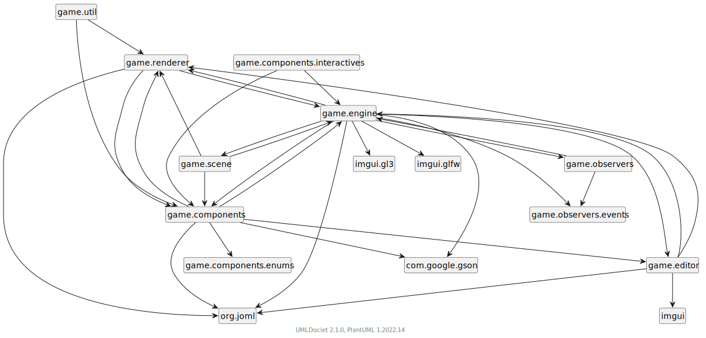

# Spiel

Um das Spiel alleine für sich zu spielen, muss in den Einstellungen
(util/Settings.java) die Variable RELEASE_BUILD auf *true* gesetzt
werden.

Bei jeder Interaktion wird das Spiel in dem Status gespeichert, wenn man also die Spieldatei neu lädt, werd der letzte stand geladen.

## Controlls

| Taste | Action |
|---|---|
| w,a,s,d | Bewegung Spieler 1 |
| Tab | Mögliche Interaktionen durchlaufen |
| e | Ausgewählte Aktion ausführen |

# Editor

Der Editor bietet eine umfangreiche Oberfläche um die Level zu gestalten und
Objekte zu bearbeiten. Der Modulare aufbau im Code wird hier aufgegriffen und
es wird ermöglicht dynamisch Objekte hinzuzufügen. Die hier verwendete Libary
für die grafische darstellung *Dear ImGUI* steuert dem bei, in dem sie die
manuelle veränderung von Variablen zur Laufzeit ermöglicht.

Der Editor besteht grundsätzlich aus mehreren Fenstern. Diese lassen sich
beliebig verschieben und anorden. In einem Fenster wird die Spiel-Kamera wieder
gegeben. Dies wird duch OpenGL ermöglich. OpenGL kann eine Scene in einen so
gennanten Framebuffer Rendern. Dieser kann damit als Textur für das Fenster in
ImGUI verwendet werden.

## Controlls

| Taste | Aktion |
| --- | --- |
| Ctrl - d | Duplizieren |
| r | um 90 Grad rotieren |
| Rücktaste | löschen |
| Bild-Auf | z-Index erhöhen |
| Bild-Runter | z-Index erniedriegen |
| Pfeil-Tasten | Um eine Zelle bewegen |
| Shift + Pfeil-Tasten | Um 0.1 Zellen bewegen |
| E | Gizmos auf Scalieren stellen |
| M | Gizmos auf Bewegen stellen |

> Alle Aktionen beziehen sich, wenn nicht explizit angegeben, auf das aktive
> Objekt, oder eine Auswahl.

| Maus | Action |
| --- | --- |
| Klicken und Ziehen | Mehrere Objekte bewegen |
| Klicken | Aktives Objekt auswählen |

## Gizmo

Die Gizmos sind Komponente des LevelEditor Stuff GameObjekt. Sie erscheinen,
wenn ein Objekt ausgewählt wird und ermöglichen das verändern der Größe und der
Position mit der Maus. Sie bestehen aus zwei Pfeilen, einer für jede Achse in
den zwei Dimensionen.

## Fenster:

### LevelEditor Stuff

LevelEditor Stuff ist schlussendlich auch ein GameObjekt. Hier werden
allgemeine Variablen festgelegt. Auch die "Gizmos" können hier bearbeitet
werden.

### Scene Hierarchy

Hier werden alle GameObjekts der aktuellen Scene aufgelistet. Eine Hierarchie
unter den GameObjects ist noch nicht Implementiert, aber geplant. Eine solche
ermöglicht es ganze Gruppen anzusteueren und die Scene besser im Überblick zu
behalten.

### Objects

Hier wird das aktuell ausgewählte *SpriteSheet* dargestellt und es wird
ermöglicht die Texturen als eigene GameObjects der Scene hinzuzufügen. Diese
haben standardmäßig keine erweiternden Komponenten, solche können aber nach
belieben hinzugefügt werden.

Prefabs sind voreingestellte GameObjecte. Diese werden im Code frei erstellt
und können im nachhinein ebenfalls frei bearbeitet werden.  Prefabs ersparen
viel arbeit, da sie iterative Prozesse erleichtern.

### Game Viewport

Hier wird das Spiel selber angezeigt werden. Dabei gibt es zwei Modis zwischen
denen man hin und her wechseln kann. Den Bearbeitungsmodus, bei dem das Spiel
pausiert ist und diverse Debuging-Tools angezeigt werden können, und dem
Spiel-Modus, bei welchem das Spiel ausgeführ wird.

# Code

Die automatisch generierten JavaDOCs mit erweiterter grafischer Darstellung
durch [plantuml](https://plantuml.com/de/) sind auf
[https://vonhirschfeld.eu/lieferfix/javadoc/](https://vonhirschfeld.eu/lieferfix/javadoc/)
(Zuletzt aufgerufen am 2024-03-14)

Der Code ist Modular aufgebaut, mit dem Ziel, neue Features einfacher zu
implementiern und eine saubere Strucktur durchzusetzen. Für einen solchen
Modularen aufbau ist eine Objekt Orientierte Programmiersprache ebenfalls
hilfreich.

Das Spiel an sich besteht schlussendlich nur aus einer *.json*-Datei. Diese kann man auch manuel angucken und bearbeiten. Alle Objekte werden so wie sie sind gespeichert.

## Packete:

Um einen Überblick zu behalten ist es wichtig, die Klassen semantisch
zu Strukturieren. Viele Programmiersprachen bieten dafür packete an.
Diese sind auch "Namespaces" vergleichbar.

### Components

Hier sind all Komponenten für die GameObjects declariert. Dafür wurde in
"Component.java" eine abstract Klasse definiert, welche die anderen jeweils
erweitern. Dadurch ist gewährleistet, das alle Componenten kompatiebel sind und
benötigte Funktionen vorhanden sind.

- AnimationState
- Component
- ComponentDeserializer
- EditorCamera
- FontRenderer
- Frame
- GameCamera
- Gizmo
- GizmoSystem
- GridLines
- Interaktive
- InteraktiveGizmo
- Inventar
- Item
- KeyControls
- MouseControls
- NonPickable
- PlayerController
- Rigidbody
- ScaleGizmo
- Sprite
- SpriteRenderer
- Spritesheet
- StateMachine
- TranslateGizmo

Eine Interesante Komponente ist die *StateMachine* diese speichert
States zwischen denen gewechselt werden kann. Die StateMachine wird
in erste linie genutzt um die Animationen zu Managen. Man kann
konkret festlegen zu welchem State bei welchem Event, basierend auf
dem aktuellen State, gewechselt wird.

Als Beispiel, egal in welche Richtung sich der Spieler bewegt, wird
das Event "StopRun" ausgelöst, wenn dieser Stoppt. Dieses Event
sorgt aber nicht dafür, dass er in irgendeine *idleanimatuin*
übergeht, sondern basierend darauf, in welche Richtung er sich
bewegt hat, wird enstprechend der nächste State gesetzt.

### Editor

In diesem Packet wird ImGUI aufgesetzt und alles was nötig ist, um den Editor zum Laufen zu bringen.

### Engine

Hier lebt das Herz des Spieles. Die grundlegendsden Automtisierungen finden
hier statt. Neben den Maus- und Key-Listener werden hier auch die Objekte
serialisiert.

### Observer

Obverser tragen das EventSystem. In desem können diverse Objekte als Observer
deklariert werden, welche dann auf Events, als Enums, reagieren können.

### Renderer

OpenGL war und ist ein standard für die Interaktion mit der GPU. Dabei werden
direkt Verticies in eine Speicher der GPU kopiert um dort von Shadern
verarbeitet zu werden. Im prinzip gibt es zwei Shader, welche programmiert
werden müssen. Einemal den Vertex-Shader und den Fragmen-Shader. Der
Vertex-Shader verarbeitet die Verticies und gibt informationen an den
Fragment-Shader weiter. Diese iteriert über jeden Pixel auf dem Bildschirm und
legt seine Farbe fest.

### Util

In Utils werden einiege Einstellungen und Hilfefunktionen
bereitgestellt. Neben dem wechseln zwischen der GameEngine und dem
Spiel selber (*RELEASE_BUILD*) muss hier der abselute Pfad zu einem
gültigen Spieleordner. Für das standardspiel Sollte der
Projektordner selber angegeben werden.

## Bibliotheken

### LWJGL

- Liezens: BSD-3-Clause
- Link: <https://www.lwjgl.org/>

"Leight Weight Java Game Libary" bietet Zugang zu nativen APIs, welche bei der
Entwicklung von Grafik- (OpenGL, Vulkan), Audio- (OpenAL) und
Parallel-Computin-Anwendungen (OpenCL) notwendig sind. Es besteht aus
sogenannten "Bindings" für die Jeweiligen Anwendungen. Die ursprünglichen APIs
sind in diesem fall nicht in Java geschrieben und werden so zu sagen übersetzt.

Der Quellcode ist unter der BSD-3-Clause Liezens offen verfügbar und wird von
einem Kollektive und Freiwilligen aktive erweitert und aktualisiert.

Zu dem ist LWJGL modular aufgebaut. Man kann das benutzen, was man braucht. Bei
der Entwicklung unseres Spieles brauchen wir folgende Module:

#### GLFW

- Liezens: Zlib license
- Link: <https://www.glfw.org/>
- Entwickelt in: c

GLFW (Graphics Library Framework) ist eine Multi-Plattform Bibliothek für
OpenGL, OpenGL ES und Vulkan. Sie erlaubt es über eine simplere API Fenster,
Kontexte, Oberflächen, Input und Events zu Managen. Über diese Bibliothek
werden wir in erster Linie das Fenster an sich und den Input verarbeiten.

#### OpenGL

- Liezens: Eigene, erlaubt es die Software zu verändern und zu verteilen (Mit Bedingungen)
- Link: <https://www.khronos.org/opengl/>
- Entwickelt in: c

OpenGL® ist die am weitesten verbreitete 2D- und 3D-Grafik-API der Branche, die
Tausende von Anwendungen auf einer Vielzahl von Computerplattformen ermöglicht.
Sie ist unabhängig von Fenstersystemen und Betriebssystemen sowie
netzwerktransparent. OpenGL ermöglicht es Entwicklern von Software für PC-,
Workstation- und Supercomputing-Hardware, hochleistungsfähige und visuell
ansprechende Grafiksoftwareanwendungen für Märkte wie CAD, Inhaltserstellung,
Energie, Unterhaltung, Spieleentwicklung, Fertigung, Medizin und virtuelle
Realität zu erstellen. OpenGL stellt alle Funktionen der neuesten
Grafikhardware zur Verfügung.

Über OpenGL können wir direkt mir der GPU Kommunizieren, Texturen speicher und
mit eigenen Shadern beeinflussen, wie die Grafikkarte etwas verarbeitet. Gerade
diese Shader, welche in einer eigenen Sprache geschrieben sind, erweitern die
Möglichkeiten, auch enorm für PixelGrafik. So können wir zum Beispiel
dynamisches Licht gestalten und vieles mehr. Essenziell ist unter anderem die
Möglichkeit "Vertex" Buffer direkt an die GPU zu senden und so optimal wie
möglich die Oberfläche zu gestalten.

OpenGL wird unter anderem aktive weiterentwickelt von: Google, Nvidia, Apple,
AMD, Huawei, Intel, ...

#### OpenAL

- Liezens: GNU LIBRARY GENERAL PUBLIC LICENSE
- Link: Aktuellster Fork: <https://github.com/kcat/openal-soft>
- Entwickelt in: c++

OpenAL ist eine plattformübergreifende API für Audio, die hauptsächlich für die
Wiedergabe von 3D-Sound und räumlichen Audioeffekten verwendet wird. Es
ermöglicht Spieleentwicklern, realistischen Klang in ihren Spielen zu erzeugen,
indem sie Klangeffekte basierend auf der Position und Bewegung von Objekten im
Spielumfeld platzieren können. OpenAL bietet eine einfache Möglichkeit,
komplexe Audioeffekte zu erzeugen und bietet Unterstützung für verschiedene
Audioformate und -geräte.

Wir werden uns in erster Linie darauf Konzentrieren, dass wir überhaupt Sound
haben und auch dafür ist OpenAL ideal.

### GSON

- Entwickelt von: Google
- Liezens: Apache-2.0 license
- Link: <https://github.com/google/gson>
- Entwickelt in: Java

Gson ist eine Java-Bibliothek, die verwendet werden kann, um Java-Objekte in
ihre JSON-Darstellung zu konvertieren und wieder zurück. Dies ermöglicht es uns
Level, Szenen, Entitäten und Items extern zu speichern und dynamisch zu Laden.
Wir planen auch den Spielstand und viele andere Daten so zu Speichern und
zugänglich zu machen. Da wir uns bemühen unser Spiel flexibel zu gestalten
nimmt uns GSON sehr viel Arbeit und Mühe ab.

### Dear Im GUI

- Liezens: MIT license
- Link: <https://github.com/ocornut/imgui>
- Entwickelt in: C++

Dear ImGui ist eine leichte Bibliothek für grafische
Benutzeroberflächen in C++. Sie gibt optimierte Vertex-Buffer aus, die
jederzeit in die 3D-Pipeline-fähigen Anwendungen gerendert werden können. Sie ist
schnell, portabel, Renderer-unabhängig und in sich geschlossen (keine externen
Abhängigkeiten).

Diese Bibliothek ermöglicht es uns und auch später ihnen Level individuell zu
gestalten und zu formen. Es ermöglicht uns während der Laufzeit Variablen zu
verändern und so ein optimales Spielerlebnis für den Spielenden vorzubereiten.

### JOML

- Liezens: MIT license
- Link: <https://joml-ci.github.io/JOML/>
- Entwickelt in: Java

Eine einfache Bibliothek die Operationen der linearen Algebra vereinfachen.
Diese sind zum verarbeitet von Buffern für OpenGL notwendig.

### Java

Dies sind Java eigenen Pakete die wir verwenden.

Weiter Informationen zu diesen Paketen finden Sie unter:
<https://docs.oracle.com/en/java/javase/22/docs/api/index.html>

#### io

- File: um zu checken, ob ein Datei existiert
- IOException: Scheitern von Lese- und Schreiboperationen während der Laufzeit signalisieren

#### nio

Definiert Puffer, die Container für Daten sind.

- ByteBuffer
- FloatBuffer
- IntBuffer
- files.Files
- file.Paths

#### util

- ArrayList
- Collections
- HashMap
- List
[-](-.md) Map
- Vector
